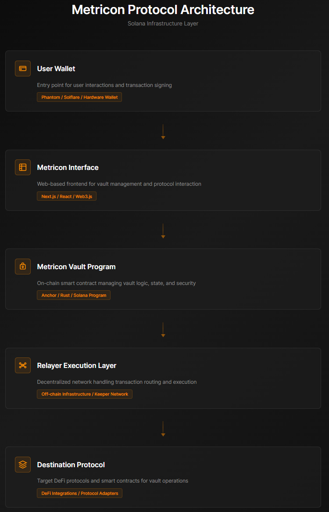

<p align="center">
  
</p>

<h1 align="center">Metricon Labs</h1>

<p align="center">
  Privacy infrastructure layer for Solana.<br/>
  Move assets without the noise.
</p>

<p align="center">


</p>

---

# Metricon Labs

Metricon Labs is building **privacy-oriented execution infrastructure for Solana**.

Public blockchains expose transaction intent by default — wallet activity, swap size, routing paths, and behavioral patterns are visible in real time. Metricon explores architectural solutions designed to reduce unnecessary signal leakage while maintaining performance, composability, and transparency.

The objective is simple:

**Enable cleaner on-chain execution without sacrificing speed, trust, or composability.**

---

# Overview

Metricon is a vault-based execution architecture designed to separate **user intent** from direct wallet exposure.

Instead of broadcasting activity directly from a primary wallet, transactions route through program-controlled vaults and structured execution layers that help reduce unnecessary signal leakage while remaining fully auditable on-chain.

Metricon is being designed as a modular infrastructure layer that can support:

- private asset movement  
- stealth-oriented routing  
- controlled execution flows  
- relayer-assisted transaction handling  

---

# Core Concepts

Metricon focuses on architectural primitives that improve execution privacy while preserving the transparency of public blockchains.

### Vault-Based Execution

Assets are deposited into **program-derived vault accounts (PDAs)** managed by the Metricon smart contract.

Vaults separate custody from execution signaling and provide a controlled environment for asset routing.

### Relayer-Assisted Execution

Relayers monitor withdrawal or routing requests and execute transactions on behalf of users, reducing direct wallet-to-wallet correlations.

### Privacy-Conscious Routing

Routing layers are designed to reduce observable behavioral patterns without introducing opaque custody or centralized control.

---

## Metricon Protocol Architecture

<p align="center">
  
</p>

<p align="center">
  <em>High-level architecture of the Metricon vault-based execution pipeline.</em>
</p>

---

## High-Level Architecture

```
User Wallet
   ↓
Vault PDA (Program Controlled)
   ↓
Routing / Execution Layer
   ↓
Destination Wallet / Bridge / Protocol
```

This architecture separates **user identity patterns** from execution logic while remaining fully verifiable on-chain.

---

# Tech Stack

Metricon is built using a modern Solana development stack.

- **Solana**
- **Anchor (Rust)**
- **TypeScript**
- **Next.js**
- **Supabase**
- **Web3.js**

---

## Repository Structure

```
programs/metricon_vault → Anchor smart contract (Rust)
src/                    → Next.js frontend
relayer/                → Execution relay logic
supabase/               → Database schema and backend configuration
idl/                    → Anchor IDL for client integration
docs/                   → Protocol documentation
```

---

## Whitepaper

The full protocol design and system architecture are documented in the Metricon whitepaper.

See:

`docs/whitepaper.md`

The whitepaper outlines:

- system architecture
- vault custody model
- relayer execution layer
- privacy design principles
- future development roadmap

---

# Development Status

Metricon is currently in **active development**.

Core components currently under development include:

- vault smart contract mechanics  
- relayer execution infrastructure  
- frontend vault management dashboard  
- swap and bridge routing flows  
- security and execution design improvements  

Major architectural decisions and protocol mechanics are documented within this repository.

---

# Philosophy

Privacy and transparency are not opposites.

Users should be able to execute transactions without unnecessary exposure, while protocol design and implementation remain open, documented, and auditable.

Metricon is built around this balance.

---

# Links

**Website**  
https://www.metriconlabs.com

**X / Twitter**  
https://x.com/MetriconLabs

**GitHub**  
https://github.com/ahsaxyz/metricon-labs

---

© 2026 Metricon Labs
